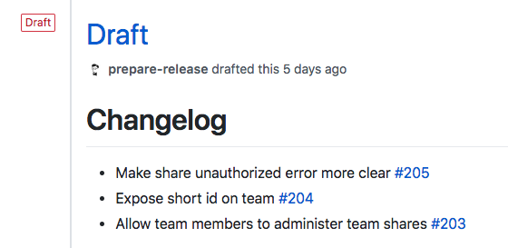

> **NOTE**: This project has been deprecated as rebase merging support has recently been added to [Release Drafter](https://github.com/toolmantim/release-drafter).

# Prepare Release

A GitHub app that drafts release notes from your merged pull requests since the last release. This bot was inspired by [Release Drafter](https://github.com/toolmantim/release-drafter) which does more or less the same but doesn't support rebase merging. This bot supports rebase merging as well as all other merge strategies.



## Development set-up

```sh
# Install dependencies
yarn

# Run typescript
yarn build:watch

# Run the bot
yarn dev
```

See the [Probot deployment docs](https://probot.github.io/docs/deployment/) if you would like to run your own instance of this plugin.
